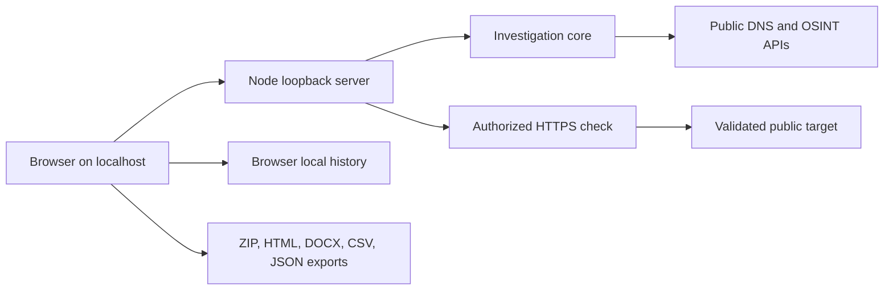

# Architecture

## Components

| Component | Purpose |
|---|---|
| `server.mjs` | Node HTTP server bound to `127.0.0.1`; serves fixed static assets and routes API calls. |
| `src/worker.mjs` | Shared investigation core: validation, public HTTP sources, geolocation aggregation, DNS, network, subdomain, exposure, and evidence normalization. |
| `src/web-posture.mjs` | Separate authorized HTTPS header, certificate, and `security.txt` check with public IPv4 validation and pinned connection. |
| `dist/app.js` | Browser UI, local history integration, case enrichment, report generation and downloads. |
| `src/local-history.mjs` | Bounded recent-case storage in browser localStorage. |
| `dist/map-ui.mjs` | MapLibre rendering, visual clustering, source points, and provider spread circle. |

## Request flow

The browser does not receive optional API keys. The server does not maintain a user database. Cases and notes are held by the browser profile, subject to localStorage limits and deletion when site data is cleared. The app never binds to a public network interface. Public map tiles and public intelligence services still receive lookup requests, so local hosting does not make the investigation offline or private from those providers.

## API

| Route | Use |
|---|---|
| `GET /api/investigate?domain=&ip=` | Main bounded public investigation. |
| `GET /api/subdomains?domain=` | Deep passive subdomains and limited current DNS checks. |
| `GET /api/exposure?ip=` | Shodan InternetDB passive exposure snapshot. |
| `GET /api/dns-posture?domain=` | NS, MX, SPF, DMARC, CAA observations. |
| `POST /api/web-posture` | Two authorized HTTPS requests, with same-origin enforcement and private destination blocking. |
| `GET /api/me` | Reports local mode for the UI. |

## Build and dependencies

Node.js 22+ is required. `npm ci` installs MapLibre GL JS and JSZip. `npm run build` refreshes vendored browser files. The bundled DOCX browser library and third-party notices are in `dist`. `npm test` runs the built-in Node test runner. The app does not require a cloud database, hosted Site, Google OAuth, or a paid API.

## Known architecture limits

The main investigation core retains some unused hosted authentication adapter code for compatibility with its original test suite. Local mode intercepts account routes, does not configure a database, and exposes no cloud history. Network lookups depend on third-party availability and quotas. In-memory rate limiting resets when the process restarts. The authorized HTTPS check supports public IPv4 targets; IPv6-only websites are not checked by that feature.
